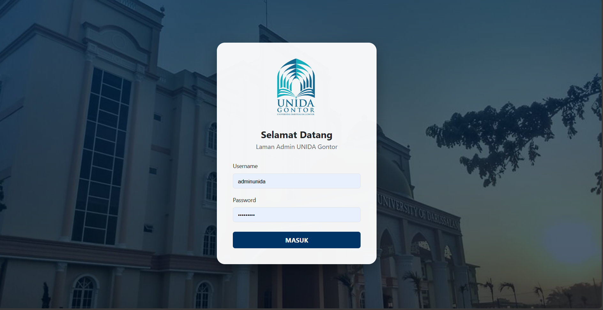
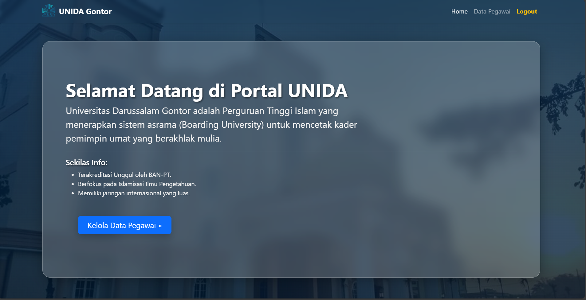
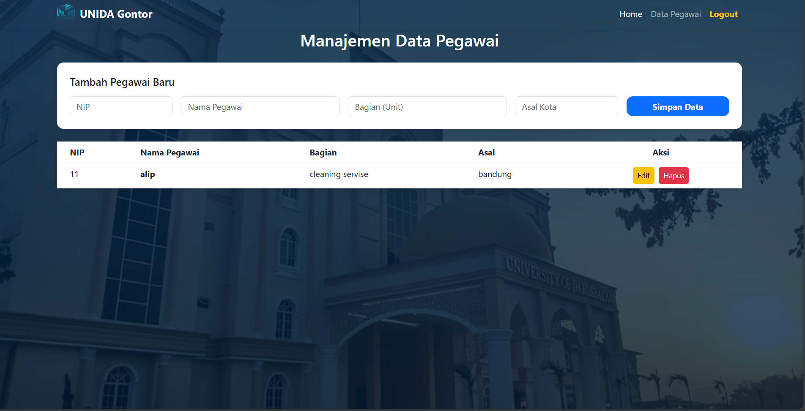

# 🏛️ UNIDA Employee Management System

> **Fountain of Wisdom - Integrated Digital Platform**


Sistem Informasi Manajemen Kepegawaian (SIMPEG) untuk Universitas Darussalam Gontor. Proyek ini menggabungkan fleksibilitas **MongoDB** dengan struktur **PHP** yang solid untuk pengelolaan data kader peradaban.

---

## ✨ Features

- **Glassmorphism Dashboard**: Antarmuka modern dengan efek blur kaca transparan di halaman Home.
- **Secure Admin Login**: Proteksi akses menggunakan kredensial admin terverifikasi.
- **CRUD Operations**: Manajemen data pegawai (Tambah & Hapus) yang terintegrasi langsung ke NoSQL.
- **Responsive Design**: Tampilan optimal di berbagai perangkat berkat Bootstrap 5.3.

---

## 🖼️ Preview

|     Login Page      |      Home Page       |     Data Pegawai     |
| :-----------------: | :------------------: | :------------------: |
|  |  |  |

---

## 🛠️ Tech Stack

- **Backend:** PHP 8.x
- **Database:** MongoDB Atlas / Local
- **Frontend:** HTML5, CSS3 (Glassmorphism), JavaScript
- **Styling:** Bootstrap 5.3

---

## 📂 Project Structure

```text
kepegawaian_unida/
├── asset/              # Assets (Images, Logos)
├── vendor/             # Composer Dependencies
├── config.php          # Database Connection
├── landing.php         # Public Landing Page
├── login.php           # Admin Entrance
├── home.php            # Main Dashboard (Glassmorphism)
├── index.php           # Employee Database (CRUD)
└── processes/          # Logic Handlers (Simpan & Hapus)
⚙️ Quick Start
1. Database Setup
Pastikan layanan MongoDB sudah berjalan di localhost:27017.

2. Install Dependencies
Gunakan Composer untuk menginstal driver MongoDB:

Bash
composer require mongodb/mongodb
3. Run Server
Buka terminal di folder proyek dan jalankan perintah:

Bash
php -S localhost:8000
4. Visit Web
Akses http://localhost:8000/landing.php di browser kamu.

🔐 Admin Access
Username: adminunida

Password: unida2026

👤 Author
Project: Dasar pemrograman web
❕❕
our team:
--shahan syah--
--ibnu nafis--
--ramah hidayah--

Institution: Universitas Darussalam Gontor
```
